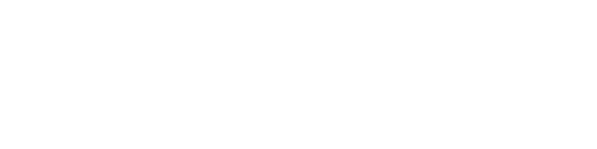
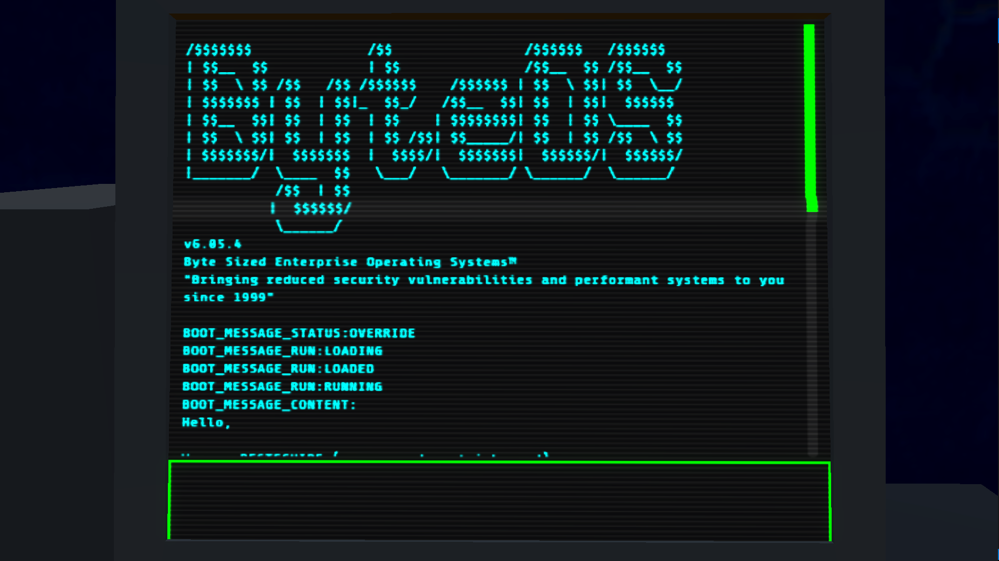

# ZeroYaHero's Portfolio

This repository is a temporary aggregation of some of my proudest, underapprecieated, or elusive work. Some of the entries <ins>BUT NOT ALL</ins> have their own GitHub repositories, so if thats what you are looking for and don't want any "distractions," feel free to just look at my account.

## Tech Art
Looking for a portfolio subset focused on tech-art? [ShadersAndRenders/README.md](ShadersAndRenders/README.md)

## Class Generator

GUI that generates Verse code and UEFN devices (UE actor properties) given a set of configurations that need to be combined using cartesian product. The graphics are not great, but I needed something that just works. Tool created and used for contract work. I will not go too much in detail considering the source is available.

[GitHub](https://github.com/ZeroYaHero/UEFNClassGenerator)

## ZeRayTracer

CPU Ray Tracer coded from scratch in C++ with CMake build system. Contains different material types, camera effects, and multithreading.

[GitHub](https://github.com/ZeroYaHero/ZeRayTracer)

## Storm Box 

Full game made and published by myself in the Fortnite UGC ecosystem.

- Procedural and Randomized Storm
- Procedural and Randomized Environment Generation System (using [VerseNoise](#versenoise))

    
- UE Materials (Storm, UI, Landscape)
- Substance 3D Materials (Lobby Walls/Floor/Ceiling, Cardboard Box, Platform)
- Blender Models and Rigs (Cardboard Box, Platform, Terrain Prefabs, Lobby)
- Logo Design
- Blender Key Art & Renders (Logo, Animation, and Thumbnail)

[GitHub](https://github.com/ZeroYaHero/StormBox)

## VerseNoise

Custom Noise program in UE/UEFN Verse inspired by Perlin Noise and utilizes Fractal Brownian Motion (FBM). There is no native noise method and no bitwise operators in Verse, so it completely is reliant on `mod`. This made it a little bit of challenge to stay somewhat performant.

[GitHub](https://github.com/ZeroYaHero/VerseNoise)

[Video](https://x.com/ZeroYaHero/status/1765820934768771317)

## BugByte (WIP)

BugByte is a work-in-progress narrative arcade game created in Godot. The story starts with a character which has applied for hundreds of jobs, but gets rejected from all of them...except one.

One night a response to an application lands in their inbox, and it is not a rejectiuon this time. Oddly enough, the character has no evidence or recollection that they even applied. In desperation, they accept (I mean, can you blame them? No interview!)

The character and you learn the details of the job on the spot through a terminal. The computer which was used to look at job rejections, is now barebones shell interface. The company claims its for security and increased performance.

This limited look into this job leads you wondering what is actually happening? What is that your job is actually doing? Are you doing the right thing?

## "Dead by Daylight" Inspired QTE/Skill Check

Hand drawn assets in Procreate. UI was then scripted in Verse. The logic is relatively simple. The track is a normalized 0 to 1 range. When the button is pressed, position is evaluated and compared to the "critical" point (at very low level float tolerance). If no success, the position is compared at the "safe zone" tolerance (red box). A critical and hit can be customized to offer a different amount of progress, the total necessary progress is customizable, and the system provided a way to make progress to be universal to a lobby or individual. 

[Gist](https://gist.github.com/ZeroYaHero/17463e55a8f0a9be01fcd9c55fe1a8e0)

[Video](https://x.com/ZeroYaHero/status/1735732924182327667)

## HP Customizer

Mechanic made in Verse and UE material graph. Visual component that allows players to modify their own health. This was a commissioned piece for [Raider464's most popular game which hits peak ccu of around 10k daily](https://fortnite.gg/island?code=1832-0431-4852)

[Video](https://x.com/ZeroYaHero/status/1915778658246983900)

## VerseTriggerVolumes: OOP Excercise

Commission for another UEFN creator. OOP is not my favorite and as I learn the more I prefer ECS. However, for this project I wanted to push it to the limits. Abstracts trigger volumes by allowing the user to select positions or source entities/actors transforms. 

[GitHub](https://github.com/ZeroYaHero/VerseVolumes)

<!-- ## FNGameplay: UEFN Verse Gameplay Framework (WIP)
Includes many classes and methods that abstract: state machine, persistence, teams, combat events, and more. [Gist](https://gist.github.com/ZeroYaHero/d0f17197e4f0a5a72bc1bf53e28c9860) -->

# Thats All Folks!

Sometimes I do a bad job of updating this. Feel free to shoot me an email  if you want a guaranteed look at my most recent and my best work!:
zeroyaheroofficial@gmail.com

