# ZeroYaHero's Portfolio
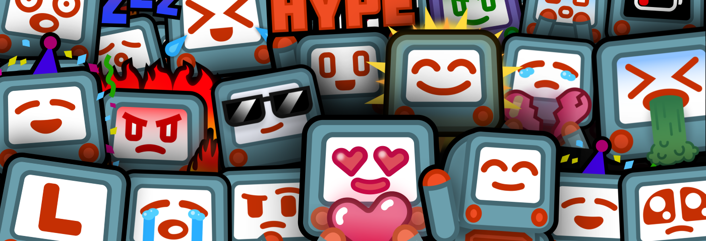
This repository is a temporary aggregation of some of my proudest, underapprecieated, or elusive work. Some of the entries <ins>BUT NOT ALL</ins> have their own GitHub repositories, so if thats what you are looking for and don't want any "distractions," feel free to just look at my account.

## ZeRayTracer

CPU Ray Tracer coded from scratch in C++ with CMake build system. Contains different material types, camera effects, and multithreading.

[GitHub](https://github.com/ZeroYaHero/ZeRayTracer)

## Zetris

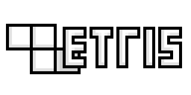

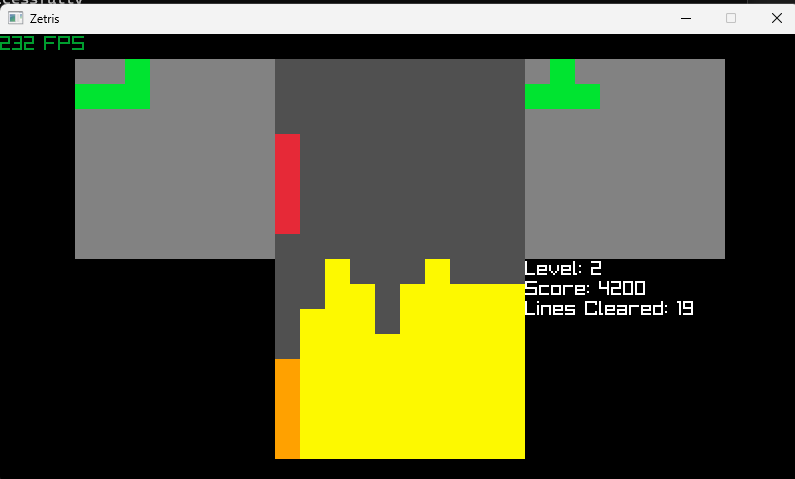

Retro game clone "engine" written in C. Playfield is encoded into 32 bit integers and the the pieces are encoded in 16 bit integers. Rotating pieces, detecting collision, and locking cells is all done with bitwise operators. Due to having everything occupy the smallest amount of memory necessary, colors are not included in current release. Intended to be something that could be added with a renderer. Engine is separate from renderer, currently offers a default renderer with Raylib, but also intends to offer a terminal version.

[Github](https://github.com/ZeroYaHero/Zetris)

## UEFN Class Generator

GUI that generates Verse code and UEFN devices (UE actor properties) given a set of configurations that need to be combined using cartesian product. The graphics are not great, but I needed something that just works. Tool created and used for contract work. I will not go too much in detail considering the source is available.

[GitHub](https://github.com/ZeroYaHero/UEFNClassGenerator)

## Storm Box 

Full game made and published by myself in the Fortnite UGC ecosystem.

- Procedural and Randomized Storm
- Procedural and Randomized Environment Generation System (using [VerseNoise](#versenoise))

    
- UE Materials (Storm, UI, Landscape)
- Substance 3D Materials (Lobby Walls/Floor/Ceiling, Cardboard Box, Platform)
- Blender Models and Rigs (Cardboard Box, Platform, Terrain Prefabs, Lobby)
- Logo Design
- Blender Key Art & Renders (Logo, Animation, and Thumbnail)

[GitHub](https://github.com/ZeroYaHero/StormBox)

## VerseNoise

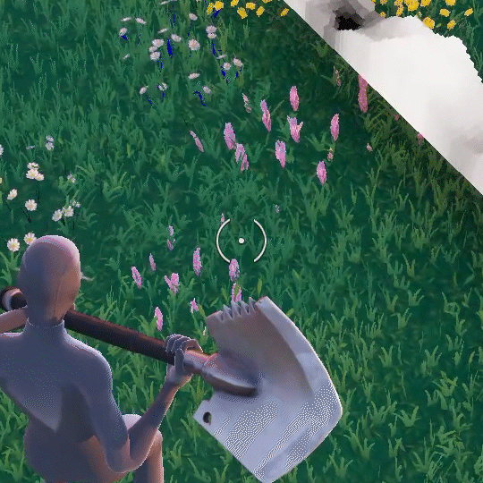

Custom Noise program in UE/UEFN Verse inspired by Perlin Noise and utilizes Fractal Brownian Motion (FBM). There is no native noise method and no bitwise operators in Verse, so it completely is reliant on `mod`. This made it a little bit of challenge to stay somewhat performant.

[GitHub](https://github.com/ZeroYaHero/VerseNoise)

[Video](https://x.com/ZeroYaHero/status/1765820934768771317)

## HP Customizer

Mechanic made in Verse and UE material graph. Visual component that allows players to modify their own health. This was a commissioned piece for [Raider464's most popular game which hits peak ccu of around 10k daily](https://fortnite.gg/island?code=1832-0431-4852)

[Video](https://x.com/ZeroYaHero/status/1915778658246983900)

## VerseVolumes: Trigger Volume Tool Written in OOP

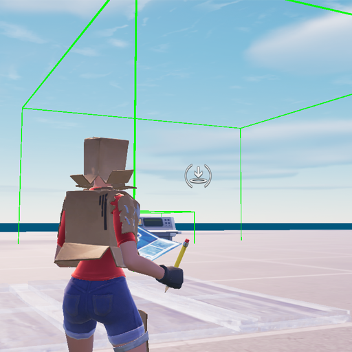

Commission for another UEFN creator. OOP is not my favorite and as I learn the more I prefer ECS. However, for this project I wanted to push it to the limits. Abstracts trigger volumes by allowing the user to select positions or source entities/actors transforms. 

[GitHub](https://github.com/ZeroYaHero/VerseVolumes)

## "Dead by Daylight" Inspired QTE/Skill Check

Hand drawn assets in Procreate. UI was then scripted in Verse. The logic is relatively simple. The track is a normalized 0 to 1 range. When the button is pressed, position is evaluated and compared to the "critical" point (at very low level float tolerance). If no success, the position is compared at the "safe zone" tolerance (red box). A critical and hit can be customized to offer a different amount of progress, the total necessary progress is customizable, and the system provided a way to make progress to be universal to a lobby or individual. 

[Gist](https://gist.github.com/ZeroYaHero/17463e55a8f0a9be01fcd9c55fe1a8e0)

[Video](https://x.com/ZeroYaHero/status/1735732924182327667)

## BugByte (WIP)
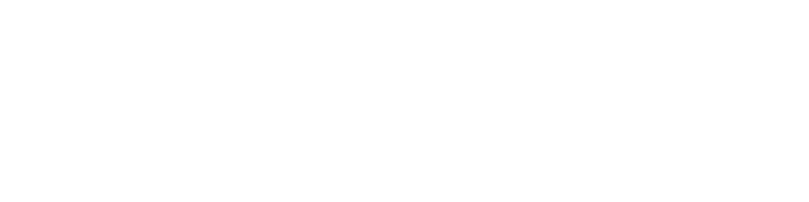

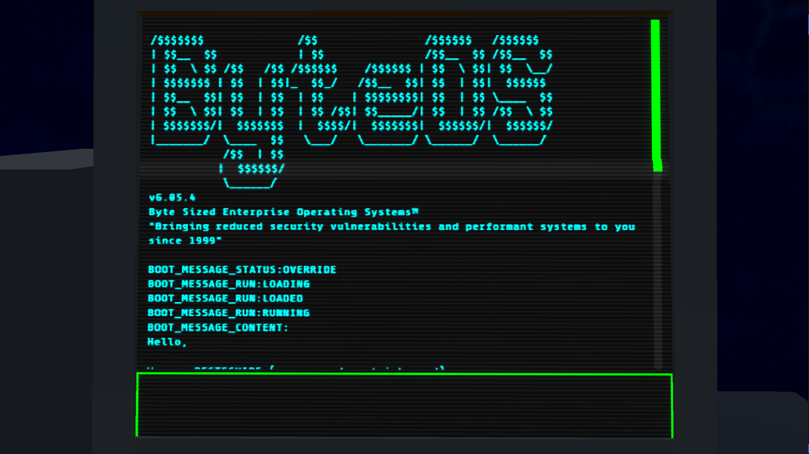

BugByte is a work-in-progress narrative arcade game created in Godot. The story starts with a character which has applied for hundreds of jobs, but gets rejected from all of them...except one.

One night a response to an application lands in their inbox, and it is not a rejectiuon this time. Oddly enough, the character has no evidence or recollection that they even applied. In desperation, they accept (I mean, can you blame them? No interview!)

The character and you learn the details of the job on the spot through a terminal. The computer which was used to look at job rejections, is now barebones shell interface. The company claims its for security and increased performance.

This limited look into this job leads you wondering what is actually happening? What is that your job is actually doing? Are you doing the right thing?

## Knockout Tour Inspired Post-Processing & Emissive Shaders
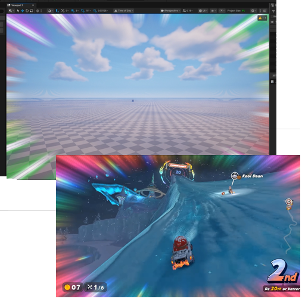'

Inspired by the new MKW game, I wanted to see if I could recreate the PP effect seen near checkpoints. It brings a sort of thrill and adrenaline that I hadn't felt in awhile. Initially, I intended on making some sort of game parodying the concept. But it ended up being a fun warmup anyways!

[Video](https://x.com/ZeroYaHero/status/1986094793387315574)

## Battle Royale Storm / Zone Inspired Shader
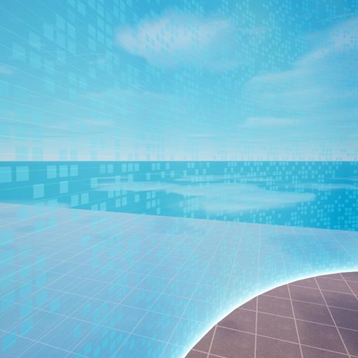

In a battle royale, one of the most important shaders is the storm or closing zone as it notifies to the player what they must avoid. Unreal Editor for Fortnite does not offer a way to read or modify some of the materials Epic Games uses for their own BR (understandably). I wanted something similar to beef up my skills. So with pure explorations (lots of trial and error) I would say I got something pretty close!

[Video](https://x.com/ZeroYaHero/status/1687967828215754753)

## Thumbnail Sparkle & Outline Utility Shader
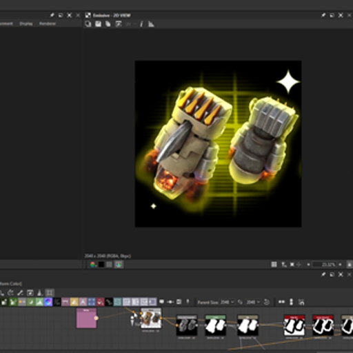

I was working with a content creator who managed a pretty popular UGC gamemode in Fortnite. Every time they updated their mode, they usually updated the thumbnail with a sparkling *new* item. The problem? They had a different "guy" do the image everytime. This seemed inefficient, so I created a substance graph that simply did the process for you automatically, with access to some parameters.

[Social Media Post](https://x.com/ZeroYaHero/status/1822694817567998083)

## Cardboard Box Model & Fire Dissolve Shader

One of my games, [Storm Box](https://github.com/ZeroYaHero/StormBox), resolved around completely procedural elements. The terrain was generated, the direction of the safe zone was randomized, and the location that players spawn was also generated. The obvious and inevitable issue is that when you generate stuff you need some way to delete it. This was a (scrapped) way to delete the cardboard boxes that players spawned in.

## Reload Realistics: Logo Renders

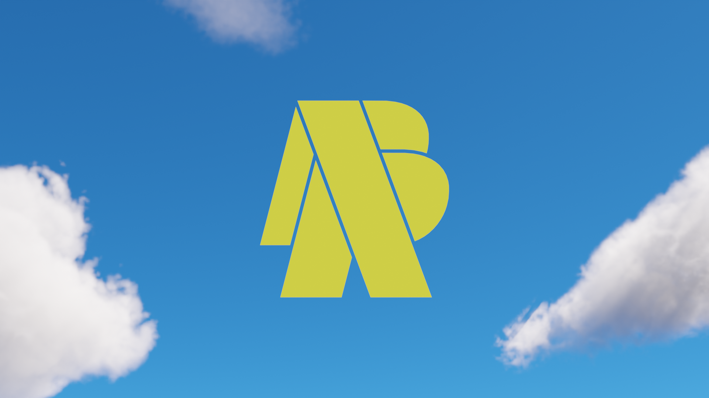

In a gamemode I made with another content creator called Reload Realistics, I wanted us to have distinct and clean branding. I made us two different logos that we could use, and rendered them in a scene with clouds in Blender.

[Social Media Post](https://x.com/Ken_Beans_/status/1891223525136138741?s=20)

## Promotional Shaders
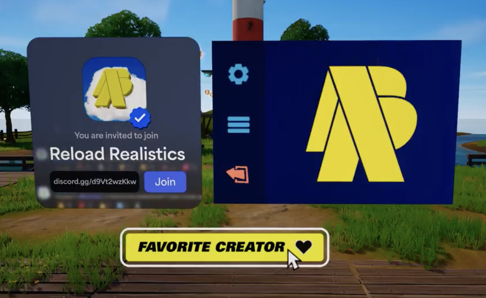

These are shaders done in Unreal Material Graph done with no flipbooks and a "keyframe" like setup. I created multiple shader functions to alleviate the process. Vector art created in Adobe Illustrator. [Video](https://x.com/ZeroYaHero/status/1928556416593260632)

## Reload Realistics: UI Holographic Button Shader
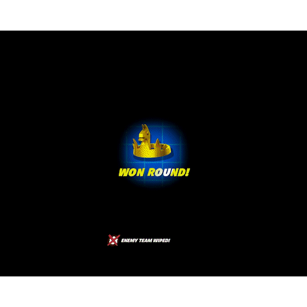

 **Reload Realistics** I designed these holographic buttons as if they were from the mode. I think it came out really clean. I used Unreal Motion Graphics (UMG) designer, Verse, and Unreal Engine Material Graph. 

[Video](https://x.com/ZeroYaHero/status/1898818115091538321)

## Sci-Fi Cube Study Shader
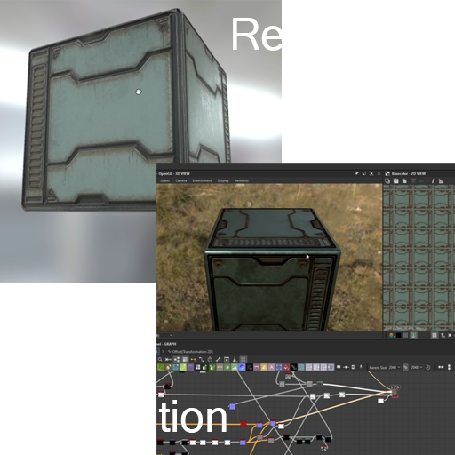

Substance designer is soooo much fun. I had no reason to mock this other than I wanted to play with the node editor.

[Reference](https://shineyquiney.artstation.com/projects/aa39z)

[Video](https://x.com/ZeroYaHero/status/1819143137819820472)

 <!-- ## UI Loading Shader

## UI Nine Slicer Shader Function

## Storm Box Thumbnail Render

## Storm Box Lobby Model & Shaders -->

<!-- ## FNGameplay: UEFN Verse Gameplay Framework (WIP)
Includes many classes and methods that abstract: state machine, persistence, teams, combat events, and more. [Gist](https://gist.github.com/ZeroYaHero/d0f17197e4f0a5a72bc1bf53e28c9860) -->

# Thats All Folks!

Sometimes I do a bad job of updating this. Feel free to shoot me an email  if you want a guaranteed look at my most recent and my best work!:
zeroyaheroofficial@gmail.com

