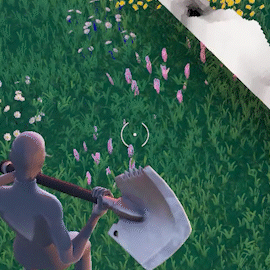

# ZeroYaHero's Portfolio

This repository is a temporary aggregation of some of my proudest, underapprecieated, or elusive work. Some of the entries <ins>BUT NOT ALL</ins> have their own GitHub repositories, so if thats what you are looking for and don't want any "distractions," feel free to just look at my account.

## Tech Art
Looking for a portfolio subset focused on tech-art? [ShadersAndRenders/README.md](ShadersAndRenders/README.md)

## Class Generator

GUI that generates Verse code and UEFN devices (UE actor properties) given a set of configurations that need to be combined using cartesian product. The graphics are not great, but I needed something that just works. Tool created and used for contract work. I will not go too much in detail considering the source is available here: [GitHub](https://github.com/ZeroYaHero/UEFNClassGenerator)

## ZeRayTracer

CPU Ray Tracer coded from scratch in C++ with CMake build system. Contains different material types, camera effects, and multithreading.

## VerseNoise

Custom Noise program in UE/UEFN Verse inspired by Perlin Noise and utilizes Fractal Brownian Motion (FBM). There is no native noise method and no bitwise operators in Verse, so it completely is reliant on `mod`. This made it a little bit of challenge to stay somewhat performant.

[GitHub](https://github.com/ZeroYaHero/VerseNoise)

[Video](https://x.com/ZeroYaHero/status/1765820934768771317)

## Procedural Terrain Generation System

Using [VerseNoise](#versenoise), I showcase how you can procedurally generate an environment with it.

The environment is constructed by sampling a position and checking if it is greater than a tolerance, spawning a terrain prefab, then applying a material based on the biome (using voroni diagram). The biomes actually have two values (humidity and temperature) to determine what assets should be used.

You will notice the odd layering and shaping of the world, and that is because I wanted to go for something akin to minecraft or the "Hallelujah Mountains" seen in the Avatar movies. The purpose of this is because the game, Storm Box, makes the Battle Royale "safe zone" a box instead, which can traverse in vertical directions. I could not have traditional landscapes because of the limited box size would prevent players from traversing. I needed a way for them to go under. I also needed a way for spawns to generate without being inside the terrain masses. This is where spatial hashing takes place, where every terrain piece that is entered in the system takes note of its dimensions. Then, when I spawn the piece with a different scale, I multiply it by those dimensions, and divide it again by the grid size. This way I can calculate how many "grid points" the terrain piece takes up, and I can mark them as "occupied" to prevent spawns from generating there. 

Because of the lack of bitwise operators in Verse, three dimensional noise takes too long to execute. I had to make a workaround, so what I did was divide up the world into layers, each with diminishing values in tolerance. The noise permutation is the same for each layer to save on performance, but each layer has a randomized coordinate offset so the layers do not line up perfectly.

[GitHub](https://github.com/ZeroYaHero/StormBox)

[Video](https://x.com/ZeroYaHero/status/1816518781092659348)

[Official Fortnite Retweet](https://x.com/FNCreate/status/1816867826478539179)

[Prototype](https://x.com/ZeroYaHero/status/1795934807538405727)

## "Dead by Daylight" Inspired QTE/Skill Check

Hand drawn assets in Procreate. UI was then scripted in Verse. The logic is relatively simple. The track is a normalized 0 to 1 range. When the button is pressed, position is evaluated and compared to the "critical" point (at very low level float tolerance). If no success, the position is compared at the "safe zone" tolerance (red box). A critical and hit can be customized to offer a different amount of progress, the total necessary progress is customizable, and the system provided a way to make progress to be universal to a lobby or individual. 

[Gist](https://gist.github.com/ZeroYaHero/17463e55a8f0a9be01fcd9c55fe1a8e0)

[Video](https://x.com/ZeroYaHero/status/1735732924182327667)

## HP Customizer

Mechanic made in Verse and UE shader graph. Visual component that allows players to modify their own health.

[Video](https://x.com/ZeroYaHero/status/1915778658246983900)

## VerseTriggerVolumes: OOP Excercise

Commission for another UEFN creator. OOP is not my favorite and as I learn the more I prefer ECS. However, for this project I wanted to push it to the limits. Abstracts trigger volumes by allowing the user to select positions or source entities/actors transforms. [GitHub](https://github.com/ZeroYaHero/VerseVolumes)

## Storm Box
PvP game within Fortnite/UEFN. Uses the recreated Fortnite Storm Shader and Procedural Environment system mentioned before.

[GitHub](https://github.com/ZeroYaHero/StormBox)

[Thumbnail/Logo Design in Adobe Illustrator and Render done in Blender](https://x.com/ZeroYaHero/status/1820099148542034383)

[Scrapped Promotional Volumetric Animation done in Blender](https://x.com/ZeroYaHero/status/1695507653219504340)
## FNGameplay: UEFN Verse Gameplay Framework (WIP)
Includes many classes and methods that abstract: state machine, persistence, teams, combat events, and more. [Gist](https://gist.github.com/ZeroYaHero/d0f17197e4f0a5a72bc1bf53e28c9860)

# Thats All Folks!

For now... Sometimes I do a bad job of updating this. Feel free to shoot me an email  if you want a guaranteed look at my most recent and my best work!:
zeroyaheroofficial@gmail.com

