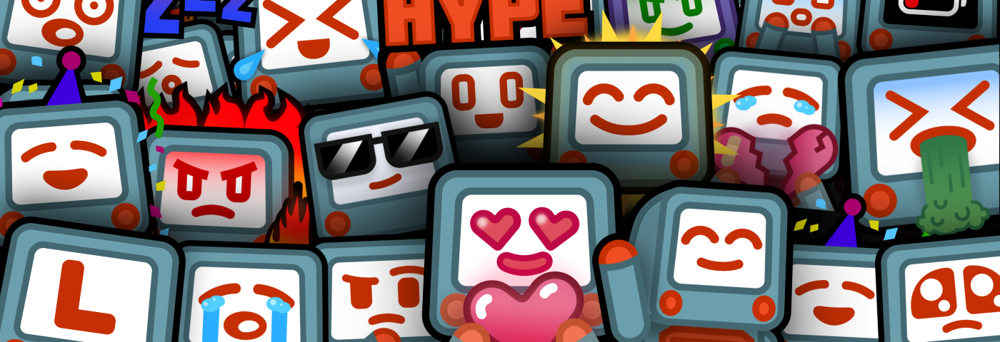
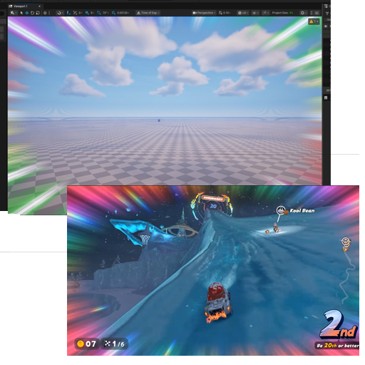
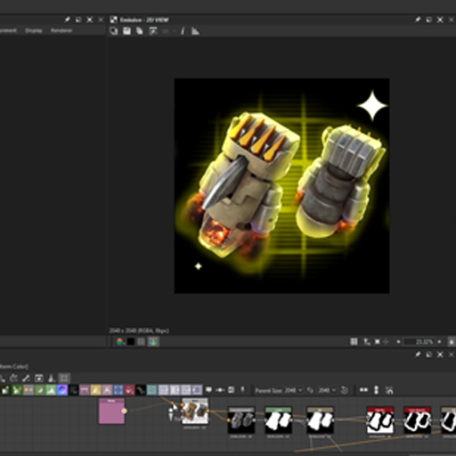
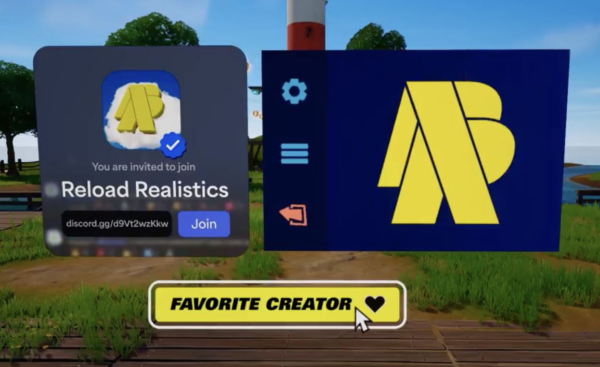
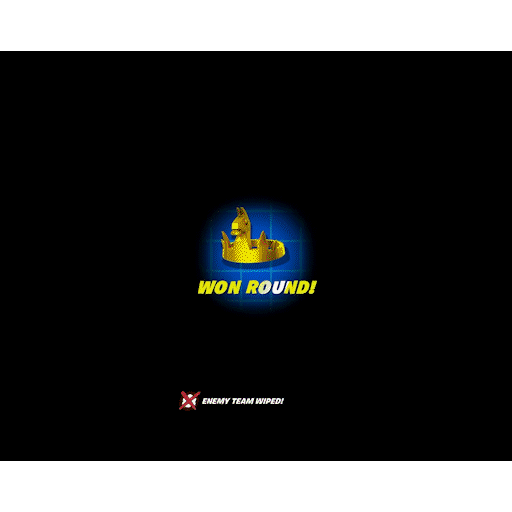
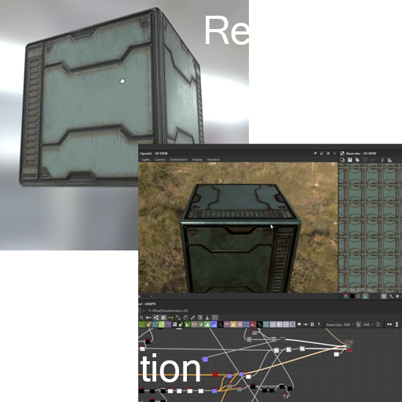

# ShadersAndRenders

Subset of the main portfolio dedicated to shaders and renders made in various softwares like Unreal, Blender, Godot, Substance, etc..

## Knockout Tour Inspired Post-Processing & Emissive Shaders
'

Inspired by the new MKW game, I wanted to see if I could recreate the PP effect seen near checkpoints. It brings a sort of thrill and adrenaline that I hadn't felt in awhile. Initially, I intended on making some sort of game parodying the concept. But it ended up being a fun warmup anyways!

[Video](https://x.com/ZeroYaHero/status/1986094793387315574)

## Battle Royale Storm / Zone Inspired Shader

In a battle royale, one of the most important shaders is the storm or closing zone as it notifies to the player what they must avoid. Unreal Editor for Fortnite does not offer a way to read or modify some of the materials Epic Games uses for their own BR (understandably). I wanted something similar to beef up my skills. So with pure explorations (lots of trial and error) I would say I got something pretty close!

[Video](https://x.com/ZeroYaHero/status/1687967828215754753)

## Thumbnail Sparkle & Outline Utility Shader

I was working with a content creator who managed a pretty popular UGC gamemode in Fortnite. Every time they updated their mode, they usually updated the thumbnail with a sparkling *new* item. The problem? They had a different "guy" do the image everytime. This seemed inefficient, so I created a substance graph that simply did the process for you automatically, with access to some parameters.

[Social Media Post](https://x.com/ZeroYaHero/status/1822694817567998083)

## Cardboard Box Model & Fire Dissolve Shader

One of my games, Storm Box, resolved around completely procedural elements. The terrain was generated, the direction of the safe zone was randomized, and the location that players spawn was also generated. The obvious and inevitable issue is that when you generate stuff you need some way to delete it. This was a (scrapped) way to delete the cardboard boxes that players spawned in.

[Social Media Post](https://x.com/ZeroYaHero/status/1913019372379025675)

## Promotional Shaders

These are shaders done in Unreal Material Graph done with no flipbooks and a "keyframe" like setup. I created multiple shader functions to alleviate the process. Vector art created in Adobe Illustrator. [Video](https://x.com/ZeroYaHero/status/1928556416593260632)

## UI Holographic Button Shader

Fortnite released a mode called **Reload** in 2024-2025 (I can't remember). It had this aesthetic with blue holograms, and I really liked the look. In a derivative gamemode **Reload Realistics** I designed these holographic buttons as if they were from the mode. I think it came out really clean. I used Unreal Motion Graphics (UMG) designer, Verse, and Unreal Engine Material Graph. 

[Video](https://x.com/ZeroYaHero/status/1898818115091538321)

## Sci-Fi Cube Study Shader

Substance designer is soooo much fun. I had no reason to mock this other than I wanted to play with the node editor.

[Reference](https://shineyquiney.artstation.com/projects/aa39z)

[Video](https://x.com/ZeroYaHero/status/1819143137819820472)

 <!-- ## UI Loading Shader

## UI Nine Slicer Shader Function

## Storm Box Thumbnail Render

## Storm Box Lobby Model & Shaders -->

# [Back](../README.md)